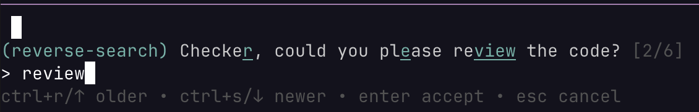

# pi-input-history

**Cross-session prompt history and fuzzy reverse search for pi.**

[](https://www.npmjs.com/package/pi-input-history)
[](https://opensource.org/licenses/MIT)

## Why

Pi's built-in ↑/↓ history only covers the current session and is lost on reload. This extension persists your last 100 prompts across sessions and adds fuzzy reverse search (default **Ctrl+R**) to find any past prompt instantly.



## Install

```bash
pi install npm:pi-input-history
```

Or from git:

```bash
pi install git:github.com/ouzhenkun/pi-input-history
```

## Usage

### Persistent History

On session start, your last 100 prompts across all sessions are loaded into the editor. Use **↑/↓** arrows to browse them as usual.

### Reverse Search

1. Press the search shortcut (default **Ctrl+R**) to open the search overlay.
2. Type to fuzzy-filter history (subsequence matching, space-separated multi-token).
3. Matched characters are highlighted with your theme's accent color.
4. Navigate and accept:

| Key | Action |
| --- | --- |
| search shortcut / `↑` | Cycle to older match |
| newer shortcut / `↓` | Cycle to newer match |
| `Enter` | Accept match into editor |
| `Esc` / `Ctrl+G` | Cancel |

Defaults: search = `ctrl+r`, newer = `ctrl+s`.

## Configuration

Optional config at `~/.pi/agent/pi-input-history.json`:

```json
{
  "searchShortcut": "ctrl+r",
  "newerShortcut": "ctrl+s"
}
```

| Field | Default | Description |
| --- | --- | --- |
| `searchShortcut` | `ctrl+r` | Open reverse search; press again in the overlay to cycle older |
| `newerShortcut` | `ctrl+s` | In the overlay, cycle to a newer match |

Omit the file or any field to keep the default. After editing, run `/reload` in pi.

### Shortcut conflict with `app.session.rename`

Pi binds `app.session.rename` to `ctrl+r` by default (session picker). This extension can still use `ctrl+r`; pi logs a non-fatal conflict warning and prefers the extension shortcut at the editor level.

To silence the warning while keeping reverse search on Ctrl+R, rebind rename in `~/.pi/agent/keybindings.json`:

```json
{
  "app.session.rename": "ctrl+shift+r"
}
```

Or change `searchShortcut` in `pi-input-history.json` to another chord.

## Features

- **Cross-session persistence** — history survives across sessions automatically.
- **Fuzzy subsequence matching** — type partial characters in order, multi-token support with spaces.
- **Character-level highlighting** — matched positions shown with accent color underline.
- **Deduplication** — no duplicate entries across sessions.
- **Current session awareness** — merges live branch history with cached cross-session history.
- **Configurable shortcuts** — override via `pi-input-history.json`.

## Acknowledgments

The reverse search component is inspired by [pi-readline-search](https://github.com/mrshu/pi-readline-search) by [@mrshu](https://github.com/mrshu).

## License

MIT
